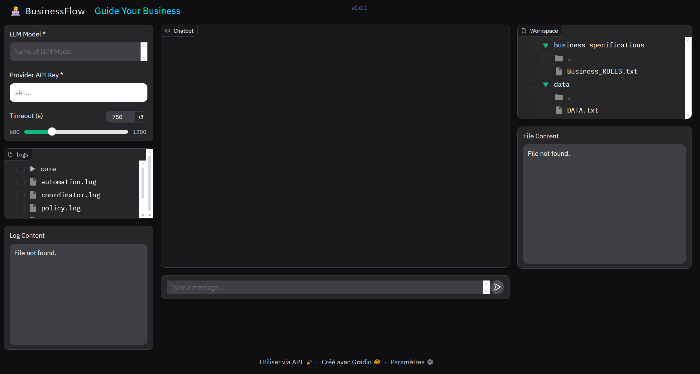

# 🧠 BusinessFlow — Multi‑Agent Business Assessment Platform

BusinessFlow is a **collaborative multi‑agent system** designed to help users **analyze, assess, and reason about the likelihood of success of their business ideas** by combining structured business logic, quantitative data analysis, and automated reporting.

The architecture is inspired by how real-world enterprises operate: different specialized teams work in parallel, follow strict governance rules, validate each other’s outputs, and only proceed when explicit approvals are granted. In this project, each team is represented by an **autonomous AI agent**, and their collaboration is orchestrated using the **Agent-to-Agent (A2A) protocol**.

Each agent focuses on a clearly defined responsibility and communicates only through well-defined interfaces. Internal capabilities such as document retrieval, data transformation, KPI computation, and automation are exposed through a **Model Context Protocol (MCP)** server implemented with **FastMCP**. This separation ensures modularity, auditability, and enterprise-grade control.

The project highlights the interoperability between **A2A** (for agent communication and coordination) and **MCP** (for tool and capability exposure). While these two protocols serve different purposes, together they enable a robust, scalable, and governable AI-driven business analysis system.

> 🎯 **Core objective:** Help founders, analysts, and decision‑makers evaluate whether a business idea is coherent, data‑aligned, and realistically viable — *before* committing resources.

---

## 🏗️ High‑Level Architecture

```
User (Gradio UI)
        │
        ▼
Policy Enforcer Agent
        │
        ▼
Coordinator Agent  ── Human-In-The-Loop
        │
        ▼
Business Validator Agent
        │
        ├── Parallel Execution ───────────────┐
        │                                     │
        ▼                                     ▼
   Data Agent                           Business Agent
        │                                     │
        └──────────► Aggregator Agent ◄───────┘
                            │
                            ▼
                QA Validator Agent ── (APPROVED / CRITIQUE)
                            │
                Iterative Refinement Loop
                            │
                            ▼
                Automation Agent (Email Report)
```

---

## Architecture

The system is organized around a **Coordinator Agent** that manages task execution, sequencing, and human-in-the-loop validation. All agents run using **Google ADK** and communicate exclusively through the **A2A protocol**, ensuring loose coupling and clear responsibilities.

### Core Agents

* **Coordinator Agent** *(Python, Google ADK, A2A)*
  Acts as the central orchestrator of the system. It receives the user’s business idea, decomposes the overall objective into atomic tasks, and routes each task to the appropriate specialized agent. The coordinator enforces **human-in-the-loop controls** by requesting explicit user approval before moving to the next task and by relaying any clarification questions back to the user.

* **Business Validator Agent** *(Python, Google ADK, A2A, MCP)*
  Responsible for executing and supervising the business validation pipeline. This agent aggregates data from user-provided documents and external sources (Google search), defines and enforces business rules, validates assumptions, and checks logical consistency across all intermediate outputs produced by other agents. It evaluates feasibility, detects contradictions or incoherencies, and ensures that all results satisfy predefined quality and validation criteria before they can be approved and passed to downstream automation steps.

* **Email Automation Agent** *(Python, Google ADK, A2A, MCP)*
  Responsible for generating the final business assessment report and delivering validated system outputs and decisions to the user. This agent interfaces with a mailing service exposed via the MCP server to reliably send the generated report, ensuring correct formatting, completeness, and traceability of the communicated results.

* **Policy Enforcer Agent** *(Python, Google ADK, A2A)*
  Acts as a governance and safety layer between the user and the system. All user inputs and agent outputs are inspected and sanitized by the Policy Enforcer to ensure compliance with enterprise rules, security constraints, and content policies.

### Workflow

1. The user submits a business idea or automation request.
2. The **Policy Enforcer** sanitizes and validates the input.
3. The **Coordinator Agent** decomposes the request into tasks and asks the user for approval before starting.
4. Tasks are dispatched to specialized agents (Validator, Automation) via **A2A**.
5. Each agent may invoke tools through the **MCP server** to complete its task.
6. Results are validated, logged, and presented to the user for approval.
7. Only after approval does the coordinator proceed to the next task, ensuring a strict **human-in-the-loop** workflow.

---

## ✨ Key Features

* 🧩 **Strict multi‑agent orchestration**
* 🔄 **Parallel data collection & business analysis**
* 🧪 **QA‑driven approval gate before automation**
* 👤 **Human‑in‑the‑loop approvals at every critical step**
* 📦 **Tooling via MCP (RAG, file ops, email automation)**
* 🧾 **Full observability with per‑agent logging**
* 💬 **Interactive Gradio chat interface**

---

## 🧰 MCP Tools

The system exposes tools via a **FastMCP server**:

* `rag_retrieve` — Retrieve & rank documents
* `read_file` — Read workspace files
* `create_file` — Persist reports
* `create_folder` — Workspace management
* `send_email` — Email automation

---

## 📊 Agent Observability

Each component logs to its **own file**:

| Component          | Log File               |
| ------------------ | ---------------------- |
| Coordinator        | `logs/coordinator.log` |
| Business Validator | `logs/validator.log`   |
| Automation Agent   | `logs/automation.log`  |
| Policy Enforcer    | `logs/policy.log`      |
| Main App           | `logs/workflow.log`    |

Custom loggers ensure:
* Consistent tracing
* Isolation per agent
* Easy debugging

---

## 💬 User Interface (Gradio)



---

## 🚀 How to Run

### 1️⃣ Install dependencies

```bash
uv pip install -r requirements.txt
```

### 2️⃣ Set environment variables

```bash
export GOOGLE_API_KEY=your_key
export MODEL=gemini-2.5-flash
export GOOGLE_GENAI_USE_VERTEXAI="FALSE"
export GOOGLE_GENAI_USE_VERTEXAI=0
export VALIDATOR_AGENT_URL="http://localhost:8002"
export EMIAL_AUTOMATION_AGENT_URL="http://localhost:8003"
export Timeout='600'
export LOGGING_LEVEL="INFO"
```

### 4️⃣ Launch Gradio app

```bash
uv run .
```

---


## 🏁 Final Note

BusinessFlow is **not a chatbot**.

It is a **decision‑support system** built to reason, validate, critique, and only then act — mirroring real‑world business governance.

---

## 📄 License

This project is licensed under the MIT License - see the [LICENSE](LICENSE) file for details.

---